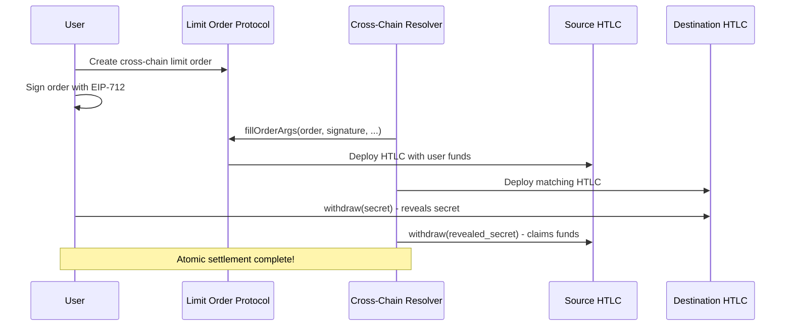

# 🌉 Cross-Chain Limit Order Integration Guide

## 🎯 Overview

This guide shows how to integrate the **1inch Limit Order Protocol** with the **Cross-Chain Resolver** to create atomic cross-chain limit orders.

## 🏗️ Architecture

### **Integration Flow:**
```
[User Creates Order] → [Resolver Fills Order] → [Deploys HTLCs] → [Atomic Settlement]
```

### **Components:**
1. **Limit Order Protocol** - Order creation and execution
2. **Cross-Chain Resolver** - Orchestrates cross-chain swaps
3. **HTLC Escrows** - Atomic settlement mechanism
4. **TON Bridge** - Connects TON blockchain

---

## 🚀 Step 1: Deploy Cross-Chain Infrastructure

### **Deploy Resolver and Escrow Factory**

```bash
# Navigate to the bridge CLI
cd ton-evm-bridge-cli

# Deploy resolver and escrow factory on Sepolia
npm run cli -- evm deploy --network sepolia --resolver --escrow-factory

# This will deploy both contracts and link them together
```

**What gets deployed:**
- **TestEscrowFactory** - Creates hash time-locked contracts (HTLCs)
- **Resolver** - Orchestrates cross-chain atomic swaps
- **Automatic linking** - Resolver configured with factory address

---

## 🔗 Step 2: Integration Architecture

### **How It Works:**

1. **Cross-Chain Order Creation**
```javascript
// User creates limit order with cross-chain extension
const crossChainOrder = {
    salt: BigInt(Date.now()),
    maker: userAddress,
    receiver: ethers.ZeroAddress,
    makerAsset: sepoliaUSDC,        // USDC on Sepolia
    takerAsset: bscUSDT,            // USDT on BSC (conceptual)
    makingAmount: ethers.parseUnits("1000", 6),  // 1000 USDC
    takingAmount: ethers.parseUnits("995", 6),   // 995 USDT
    makerTraits: 0n,
    // Extension contains cross-chain parameters
};
```

2. **Resolver Fills Order + Deploys Escrows**
```javascript
// Resolver calls deploySrc() which:
// - Fills the limit order on source chain
// - Deploys HTLC escrow with user's funds
// - Links escrow to destination chain parameters

await resolver.deploySrc(
    order,              // Cross-chain limit order
    r, vs,              // Order signature
    amount,             // Fill amount
    takerTraits,        // Taker configuration
    dstChainId,         // Destination chain ID
    dstResolver,        // Destination resolver address
    extensionData       // Cross-chain swap parameters
);
```

3. **Atomic Settlement**
```javascript
// On destination chain
await dstResolver.deployDst(/* matching escrow */);

// User reveals secret to withdraw on destination
await dstEscrow.withdraw(secret);

// Resolver uses revealed secret to claim on source
await srcEscrow.withdraw(secret);
```

---

## 💡 Step 3: Integration Points

### **Key Integration Mechanisms:**

#### **1. Order Extensions**
Cross-chain parameters are encoded in the order's extension field:
```javascript
const extensionData = ethers.AbiCoder.defaultAbiCoder().encode(
    ['uint256', 'address', 'bytes32', 'uint256'],
    [dstChainId, dstResolver, hashlock, timelock]
);
```

#### **2. Post-Interaction Hooks**
After order execution, escrow is automatically deployed:
```solidity
// In BaseEscrowFactory._postInteraction()
function _postInteraction(/* ... */) external {
    // Deploy HTLC escrow with filled order funds
    // Link to cross-chain parameters
}
```

#### **3. Taker Traits Configuration**
```javascript
// Pass escrow address as target
const takerTraits = TakerTraits.encode({
    hasTarget: true,
    target: escrowAddress,
    // ... other traits
});
```

---

## 🔧 Step 4: Practical Implementation

### **Deploy and Test Integration**

1. **Deploy Cross-Chain Infrastructure**
```bash
# Deploy resolver and escrow factory
cd ton-evm-bridge-cli
npm run cli -- evm deploy --network sepolia --resolver --escrow-factory

# Note the deployed addresses
```

2. **Create Integration Test Script**
```javascript
// integration-test.js
const limitOrderProtocol = await ethers.getContractAt(
    "LimitOrderProtocol", 
    LIMIT_ORDER_ADDRESS
);

const resolver = await ethers.getContractAt(
    "Resolver", 
    RESOLVER_ADDRESS
);

// Create cross-chain order
const order = createCrossChainOrder(/* parameters */);
const signature = await signOrder(order, chainId, limitOrderProtocol.address, maker);

// Resolver fills order and deploys escrows
await resolver.deploySrc(order, r, vs, amount, takerTraits, /* cross-chain params */);
```

3. **Test Atomic Settlement**
```bash
# Run integration test
npx hardhat run integration-test.js --network sepolia
```

---

## 🌐 Step 5: Cross-Chain Flow

### **Complete Cross-Chain Limit Order Flow:**



---

## 🎯 Step 6: TON Integration

### **Extend to TON Blockchain:**

1. **TON Vault Integration**
```typescript
// Deploy TON vault contracts
cd ton-evm-bridge-cli
npm run cli -- ton deploy --network testnet

// This deploys vault.fc with HTLC capabilities
```

2. **Cross-Chain Message Bridge**
```javascript
// Listen for TON transactions
const tonClient = new TonClient(/* config */);
await tonClient.waitForTransaction(/* tx params */);

// Verify on EVM side
await resolver.verifyTonTransaction(tonProof);
```

---

## 🔍 Step 7: Verification and Monitoring

### **Monitor Cross-Chain Activity:**

```bash
# Check resolver deployment
npx hardhat verify --network sepolia RESOLVER_ADDRESS

# Monitor escrow deployments
cast logs --from-block latest --address RESOLVER_ADDRESS --sig "EscrowDeployed(bytes32,address)"

# Track cross-chain settlements
cast logs --from-block latest --address ESCROW_ADDRESS --sig "Withdrawn(address,uint256)"
```

---

## 📊 Integration Benefits

### **Advantages of This Architecture:**

✅ **Atomic Settlement** - Both chains execute or both revert
✅ **Limit Order Compatibility** - Uses standard 1inch orders
✅ **Gas Efficient** - Batched operations reduce costs
✅ **Flexible Resolvers** - Owner-controlled for custom logic
✅ **Security Deposits** - Incentivize honest behavior
✅ **Time Locks** - Prevent funds from being locked forever

### **Use Cases:**

- **Cross-Chain DEX** - Trade tokens across different blockchains
- **Arbitrage** - Exploit price differences between chains
- **TON Bridge** - Connect TON ecosystem with EVM chains
- **DeFi Composability** - Combine protocols across chains

---

## 🚀 Quick Start Commands

```bash
# 1. Deploy cross-chain infrastructure
cd ton-evm-bridge-cli
npm run cli -- evm deploy --network sepolia --resolver --escrow-factory

# 2. Test limit order protocol
cd limit-order-protocol
npx hardhat run create-real-transaction.js --network sepolia --config hardhat.simple.config.js

# 3. Create integration test
# Copy resolver address from step 1
# Update limit order script to use resolver

# 4. Monitor on Etherscan
# Check both limit order protocol and resolver contracts
```

**Your cross-chain limit order system is ready! 🌟**