# TonFusion - ETH ↔ TON Atomic Swaps

A hybrid blockchain project that enables atomic cross-chain swaps between TON blockchain and EVM chains (Ethereum/BSC) using 1inch's cross-chain swap infrastructure.

## 🏗️ Project Structure

```
TonFusion/
├── cross-chain-resolver-example/    # EVM contracts & ETH-side logic
├── TonContract_sub/                 # TON blockchain smart contracts
├── limit-order-protocol/            # 1inch Limit Order Protocol
└── old-crosschain/                  # Legacy implementation
```

## 📋 Contract Addresses

### TON Testnet
| Contract | Address | Purpose |
|----------|---------|---------|
| **Vault** | `EQD--f_k54qs29OKvLUZywXZYLQkDb6Avvv2Lxr5P4G-giua` | Main vault for atomic swaps |
| **Jetton Master** | `EQD0GKBM8ZbryVk2aESmzfU6b9b_8era_IkvBSELujFZPnc4` | Test USDT jetton |

### Ethereum (Forked/Local)
| Contract | Address | Purpose |
|----------|---------|---------|
| **1inch Limit Order Protocol** | `0x111111125421ca6dc452d289314280a0f8842a65` | Order matching |
| **USDC Token** | `0xa0b86991c6218b36c1d19d4a2e9eb0ce3606eb48` | Source token |
| **USDC Donor** | `0xd54F23BE482D9A58676590fCa79c8E43087f92fB` | Test token provider |

### BSC (Forked/Local)
| Contract | Address | Purpose |
|----------|---------|---------|
| **1inch Limit Order Protocol** | `0x111111125421ca6dc452d289314280a0f8842a65` | Order matching |
| **USDC Token** | `0x8965349fb649a33a30cbfda057d8ec2c48abe2a2` | Destination token |
| **USDC Donor** | `0x4188663a85C92EEa35b5AD3AA5cA7CeB237C6fe9` | Test token provider |

## 🔄 Atomic Swap Flows

### ETH → TON Atomic Swap


### TON → ETH Atomic Swap

```mermaid
sequenceDiagram
    participant User as User (Maker+Resolver)
    participant TON
    participant ETH

    Note over User, ETH: Phase 1: Setup
    User->>User: Generate secret & Query ID

    Note over User, ETH: Phase 2: Deposit Phase
    User->>TON: Deposit jettons with hashlock (SOURCE)
    TON->>TON: Store swap info in vault
    User->>ETH: Setup destination escrow (DESTINATION)
    ETH->>ETH: Resolver deposits USDC for user

    Note over User, ETH: Phase 3: Withdrawal Phase
    User->>ETH: Receive USDC (as maker)
    ETH->>User: Release USDC to user
    User->>TON: Manually withdraw with same secret
    TON->>User: Release jettons

    Note over User, ETH: ✅ Same secret unlocks both chains
```



## 🚀 Quick Start

### Prerequisites

- Node.js 22+
- pnpm
- Tonkeeper wallet (for TON testnet)
- Git

### Setup

1. **Clone and install dependencies:**
```bash
git clone <repository>
cd TonFusion

# ETH side setup
cd cross-chain-resolver-example
pnpm install
forge install

# TON side setup
cd ../TonContract_sub
npm install
```

2. **Configure environment:**
```bash
# In cross-chain-resolver-example/
cp .env.example .env
# Add your RPC URLs:
SRC_CHAIN_RPC=https://eth.merkle.io
DST_CHAIN_RPC=https://bsc.merkle.io
```

### Running Atomic Swaps

#### ETH → TON Demo

**Terminal 1 (ETH side):**
```bash
cd cross-chain-resolver-example
SRC_CHAIN_RPC=<ETH_RPC> DST_CHAIN_RPC=<BSC_RPC> pnpm test run-eth-only-demo.spec.ts
```

**Terminal 2 (TON side):**
```bash
cd TonContract_sub
npx blueprint run
# Select: testTransferNotification_realJettonTransfer (for deposit)
# Select: testWithdrawJetton (for withdrawal)
```

#### TON → ETH Demo

**Terminal 1 (ETH side):**
```bash
cd cross-chain-resolver-example
SRC_CHAIN_RPC=<ETH_RPC> DST_CHAIN_RPC=<BSC_RPC> pnpm test run-ton-eth-demo.spec.ts
```

**Terminal 2 (TON side):**
```bash
cd TonContract_sub
npx blueprint run
# Select: testTransferNotification_realJettonTransfer (for deposit)
# Select: testWithdrawJetton (for withdrawal)
```

## 🔧 How It Works

### Core Components

1. **Secret Generation**: 32-byte random secret shared between chains
2. **Hash Methods**: 
   - ETH: `HashLock.forSingleFill(secret)`
   - TON: `sha256(secret)`
3. **Query ID**: Channel identifier linking both transactions
4. **Atomic Execution**: Same secret unlocks funds on both chains

### ETH Side Operations

- **Deposit**: Creates cross-chain order with hashlock
- **Escrow**: Locks USDC with timelock and secret hash
- **Withdrawal**: Resolver unlocks using secret

### TON Side Operations

- **Register Deposit**: `op::register_deposit()` stores swap info
- **Transfer Notification**: Jetton transfer with forward payload
- **Withdraw**: `op::withdraw_jetton()` validates secret and releases funds

### Key Scripts

#### TON Scripts
```bash
# Deposit jettons
npx blueprint run -> testTransferNotification_realJettonTransfer

# Withdraw jettons  
npx blueprint run -> testWithdrawJetton

# Check vault data
npx blueprint run -> getVaultData
```

#### ETH Scripts
```bash
# Run ETH→TON demo
pnpm test run-eth-only-demo.spec.ts

# Run TON→ETH demo  
pnpm test run-ton-eth-demo.spec.ts

# Lint code
pnpm lint

# Build contracts
forge build
```

## 🛡️ Security Features

- **Hashlock Mechanism**: Funds locked until secret is revealed
- **Timelock Protection**: Automatic refund after expiration
- **Safety Deposits**: Incentivize honest behavior
- **Atomic Execution**: Either both chains succeed or both fail

## 🏁 Demo vs Production

| Feature | Demo Implementation | Full 1inch Protocol |
|---------|-------------------|-------------------|
| **Coordination** | Manual (2 terminals) | Automated via 1inch relayer |
| **Roles** | User plays Maker+Resolver | Separate Maker/Resolver entities |
| **Discovery** | Hardcoded addresses | Dutch auction mechanism |
| **Execution** | Manual CLI commands | Automated smart contracts |

## TON-ETH Implementation Guide

### Step 1: TON Escrow Contract Design

Create a FunC smart contract that implements the HTLC pattern:

```func
;; TON Escrow Contract State
global int status;           ;; 0=active, 1=withdrawn, 2=cancelled
global slice maker;          ;; recipient address
global slice taker;          ;; depositor/resolver address
global slice jetton_master;  ;; token contract (or null for TON)
global int amount;           ;; locked amount
global int hash_lock;        ;; SHA256 hash of secret
global int deployed_at;      ;; deployment timestamp
global int withdrawal_time;  ;; when withdrawal becomes available
global int public_withdrawal_time;   ;; when anyone can trigger withdrawal
global int cancellation_time;        ;; when cancellation becomes available
global int public_cancellation_time; ;; when anyone can cancel
```

### Step 2: Contract Functions

#### Deposit Function
```func
() deposit(slice maker_address, int hash_lock, int withdrawal_time, 
          int public_withdrawal_time, int cancellation_time, 
          int public_cancellation_time) impure {
    throw_unless(100, status == 0);  ;; must be uninitialized
    
    maker = maker_address;
    hash_lock = hash_lock;
    deployed_at = now();
    withdrawal_time = deployed_at + withdrawal_time;
    public_withdrawal_time = deployed_at + public_withdrawal_time;
    cancellation_time = deployed_at + cancellation_time;
    public_cancellation_time = deployed_at + public_cancellation_time;
    status = 1;  ;; active
}
```

#### Withdraw Function
```func
() withdraw(slice secret) impure {
    throw_unless(101, status == 1);  ;; must be active
    throw_unless(102, now() >= withdrawal_time);  ;; respect time lock
    
    int secret_hash = sha256(secret);
    throw_unless(103, secret_hash == hash_lock);  ;; verify secret
    
    ;; Transfer funds to maker
    if (jetton_master.null?()) {
        send_raw_message(begin_cell()
            .store_uint(0x18, 6)
            .store_slice(maker)
            .store_coins(amount)
            .store_uint(0, 107)
        .end_cell(), 3);
    } else {
        ;; Handle Jetton transfer
        transfer_jetton(maker, amount);
    }
    
    status = 2;  ;; withdrawn
}
```

#### Cancel Function
```func
() cancel() impure {
    throw_unless(104, status == 1);  ;; must be active
    throw_unless(105, now() >= cancellation_time);  ;; respect time lock
    
    ;; Return funds to taker
    if (jetton_master.null?()) {
        send_raw_message(begin_cell()
            .store_uint(0x18, 6)
            .store_slice(taker)
            .store_coins(amount)
            .store_uint(0, 107)
        .end_cell(), 3);
    } else {
        ;; Handle Jetton transfer
        transfer_jetton(taker, amount);
    }
    
    status = 3;  ;; cancelled
}
```

### Step 3: Time Lock Configuration

Configure time locks to match the EVM implementation:

```typescript
const timeLocks = {
    tonWithdrawal: 10,      // 10s finality lock
    tonPublicWithdrawal: 120, // 2m private withdrawal  
    tonCancellation: 121,    // 1s public withdrawal
    tonPublicCancellation: 122, // 1s private cancellation
    
    ethWithdrawal: 10,       // 10s finality lock
    ethPublicWithdrawal: 100, // 100s private withdrawal
    ethCancellation: 101     // 1s public withdrawal
}
```

### Step 4: Integration with Existing Resolver

Modify the existing `Resolver.sol` to support TON interactions:

```solidity
// Add TON-specific functions
function deployTonEscrow(
    address tonEscrowAddress,
    bytes32 hashLock,
    uint256 amount,
    address maker,
    TimeLocks memory timeLocks
) external onlyOwner {
    // Interact with TON blockchain via bridge/oracle
    // Deploy escrow contract on TON with matching parameters
}

function withdrawFromTon(
    address tonEscrowAddress,
    bytes32 secret
) external {
    // Trigger withdrawal on TON escrow using revealed secret
}
```

### Step 5: Cross-Chain Communication

Implement communication layer between TON and Ethereum:

#### Option A: Oracle-based Bridge
- Deploy oracle contracts on both chains
- Oracle validates transactions and relays state
- Higher trust assumptions but simpler implementation

#### Option B: Light Client Verification
- Implement TON light client on Ethereum
- Verify TON transactions cryptographically
- More complex but fully trustless

### Step 6: Complete Flow Implementation

#### TON → ETH Swap Flow

1. **User Creates Order** (TON)
   ```typescript
   // User deploys TON escrow with funds
   const tonEscrow = await deployTonEscrow({
       maker: userAddress,
       amount: parseCoins('100'), // 100 TON
       hashLock: SHA256(secret),
       timeLocks: tonTimeLocks
   });
   ```

2. **Resolver Fills Order** (ETH)
   ```typescript
   // Resolver deploys ETH escrow
   const ethEscrow = await resolver.deployDst({
       taker: resolverAddress,
       amount: parseEther('99'), // 99 ETH equivalent
       hashLock: SHA256(secret),
       timeLocks: ethTimeLocks
   });
   ```

3. **User Withdraws** (ETH)
   ```typescript
   // User reveals secret to claim ETH
   await ethEscrow.withdraw(secret);
   ```

4. **Resolver Withdraws** (TON)  
   ```typescript
   // Resolver uses revealed secret to claim TON
   await tonEscrow.withdraw(secret);
   ```

### Step 7: Testing Strategy

Create comprehensive tests covering:

```typescript
describe('TON-ETH Cross-Chain Swaps', () => {
    it('should complete successful TON → ETH swap', async () => {
        // Test happy path
    });
    
    it('should handle timeout cancellation', async () => {
        // Test cancellation scenarios
    });
    
    it('should prevent double spending', async () => {
        // Test security edge cases
    });
    
    it('should handle partial fills', async () => {
        // Test partial execution scenarios
    });
});
```

## Development Setup

### Prerequisites

- Node.js 22+
- pnpm
- TON Development Environment
- Foundry (for EVM contracts)

### Cross-chain Resolver Setup

```bash
cd cross-chain-resolver-example
pnpm install
forge install

# Run tests
SRC_CHAIN_RPC=<ETH_FORK_URL> DST_CHAIN_RPC=<BSC_FORK_URL> pnpm test
```

### TON Contracts Setup

```bash
cd ton-start
npm install

# Build contracts
npm run build

# Run tests
npm test

# Deploy contracts
npm start
```

## Testing

### EVM Tests
- Jest with SWC for TypeScript transpilation
- Prool for local blockchain forking
- Predefined test accounts for consistent testing

### TON Tests
- TON Sandbox for local testing
- Jest with ts-jest preset
- Standard TON test utilities

### Integration Tests
- End-to-end cross-chain swap scenarios
- Timeout and cancellation edge cases
- Security vulnerability testing

## Deployment

### Testnet Deployment

1. **Deploy EVM Contracts**
   ```bash
   # Deploy to Ethereum Sepolia
   forge script --chain sepolia --broadcast --verify
   
   # Deploy to BSC Testnet  
   forge script --chain bsc-testnet --broadcast --verify
   ```

2. **Deploy TON Contracts**
   ```bash
   # Deploy to TON Testnet
   npx blueprint run --testnet
   ```

3. **Configure Cross-Chain Parameters**
   - Set matching time locks across chains
   - Configure oracle/bridge addresses
   - Test with small amounts first

### Mainnet Considerations

- **Security Audits**: Complete professional security audit
- **Gradual Rollout**: Start with limited amounts and supported tokens
- **Monitoring**: Implement comprehensive logging and alerting
- **Emergency Procedures**: Define pause mechanisms and recovery processes

## Security Considerations

- **Time Lock Validation**: Ensure proper time lock sequencing
- **Secret Generation**: Use cryptographically secure randomness
- **Oracle Security**: If using oracles, implement multiple validators
- **Upgrade Mechanisms**: Plan for contract upgrades while maintaining security
- **Emergency Stops**: Implement circuit breakers for unusual conditions

## Contributing

1. Fork the repository
2. Create a feature branch
3. Implement changes with comprehensive tests
4. Submit a pull request with detailed description

## License

MIT License - see LICENSE file for details