# 🚀 TonFusion Demo Guide

Complete guide to running ETH ↔ TON atomic swap demonstrations.

## 📋 Contract Addresses

### TON Testnet
| Contract | Address | Purpose |
|----------|---------|---------|
| **Vault** | `EQD--f_k54qs29OKvLUZywXZYLQkDb6Avvv2Lxr5P4G-giua` | Main vault for atomic swaps |
| **Jetton Master** | `EQD0GKBM8ZbryVk2aESmzfU6b9b_8era_IkvBSELujFZPnc4` | Test USDT jetton |

### Ethereum (Forked/Local)
| Contract | Address | Purpose |
|----------|---------|---------|
| **1inch Limit Order Protocol** | `0x111111125421ca6dc452d289314280a0f8842a65` | Order matching |
| **USDC Token** | `0xa0b86991c6218b36c1d19d4a2e9eb0ce3606eb48` | Source token |
| **USDC Donor** | `0xd54F23BE482D9A58676590fCa79c8E43087f92fB` | Test token provider |

### BSC (Forked/Local)
| Contract | Address | Purpose |
|----------|---------|---------|
| **1inch Limit Order Protocol** | `0x111111125421ca6dc452d289314280a0f8842a65` | Order matching |
| **USDC Token** | `0x8965349fb649a33a30cbfda057d8ec2c48abe2a2` | Destination token |
| **USDC Donor** | `0x4188663a85C92EEa35b5AD3AA5cA7CeB237C6fe9` | Test token provider |

## 🔄 Demo Flows

### ETH → TON Atomic Swap


### TON → ETH Atomic Swap

```mermaid
sequenceDiagram
    participant User as User (Maker+Resolver)
    participant TON
    participant ETH

    Note over User, ETH: Phase 1: Setup
    User->>User: Generate secret & Query ID

    Note over User, ETH: Phase 2: Deposit Phase
    User->>TON: Deposit jettons with hashlock (SOURCE)
    TON->>TON: Store swap info in vault
    User->>ETH: Setup destination escrow (DESTINATION)
    ETH->>ETH: Resolver deposits USDC for user

    Note over User, ETH: Phase 3: Withdrawal Phase
    User->>ETH: Receive USDC (as maker)
    ETH->>User: Release USDC to user
    User->>TON: Manually withdraw with same secret
    TON->>User: Release jettons

    Note over User, ETH: ✅ Same secret unlocks both chains
```



## 🛠️ Prerequisites

- **Node.js 22+**
- **pnpm** 
- **Tonkeeper wallet** (connected to TON testnet)
- **Git**
- **Two terminals** open simultaneously

## ⚙️ Setup

1. **Clone and install dependencies:**
```bash
git clone <repository>
cd TonFusion

# ETH side setup
cd cross-chain-resolver-example
pnpm install
forge install

# TON side setup
cd ../TonContract_sub
npm install
```

2. **Configure environment:**
```bash
# In cross-chain-resolver-example/
cp .env.example .env
# Add your RPC URLs:
SRC_CHAIN_RPC=https://eth.merkle.io
DST_CHAIN_RPC=https://bsc.merkle.io
```

3. **Connect TON wallet:**
```bash
cd TonContract_sub
npx blueprint run
# Scan QR code with Tonkeeper (testnet mode)
```

## 🔵 Demo 1: ETH → TON Atomic Swap

### Terminal 1 (ETH Side)

```bash
cd cross-chain-resolver-example
SRC_CHAIN_RPC=<ETH_RPC> DST_CHAIN_RPC=<BSC_RPC> pnpm test run-eth-only-demo.spec.ts
```

**What happens:**
1. Generates 32-byte secret and Query ID
2. Creates ETH cross-chain order with hashlock
3. Deposits 100 USDC into escrow
4. Displays TON deposit instructions
5. **Waits for user to complete TON deposit**
6. Executes ETH withdrawal using secret
7. Shows final balances

**Key outputs to note:**
- 🔑 **SECRET**: Copy this for TON terminal
- 📍 **QUERY ID**: Copy this for TON terminal
- 🆔 **ETH SWAP ID**: For reference

### Terminal 2 (TON Side)

**Step 1: Deposit on TON**
```bash
cd TonContract_sub
npx blueprint run
# Select: testTransferNotification_realJettonTransfer
```

**Input the values from Terminal 1:**
- Query ID: `[from Terminal 1]`
- Secret: `[from Terminal 1]` 
- Amount: `1000` nano
- Destination (Vault): `EQD--f_k54qs29OKvLUZywXZYLQkDb6Avvv2Lxr5P4G-giua`
- Jetton Master: `EQD0GKBM8ZbryVk2aESmzfU6b9b_8era_IkvBSELujFZPnc4`

**Step 2: Return to Terminal 1 and press Enter**

**Step 3: Withdraw from TON**
```bash
npx blueprint run
# Select: testWithdrawJetton
```

**Input:**
- Query ID: `[same as before]`
- Secret: `[same as before]`
- Amount: `1000`
- Vault: `EQD--f_k54qs29OKvLUZywXZYLQkDb6Avvv2Lxr5P4G-giua`

## 🟢 Demo 2: TON → ETH Atomic Swap

### Terminal 1 (ETH Side)

```bash
cd cross-chain-resolver-example
SRC_CHAIN_RPC=<ETH_RPC> DST_CHAIN_RPC=<BSC_RPC> pnpm test run-ton-eth-demo.spec.ts
```

**What happens:**
1. Initializes ETH network as destination
2. Asks for secret input (you can provide your own)
3. Shows TON deposit instructions
4. **Waits for user to complete TON deposit**
5. Creates ETH destination escrow
6. Transfers USDC to user
7. Shows final balances

### Terminal 2 (TON Side)

**Step 1: Deposit on TON (SOURCE)**
```bash
cd TonContract_sub
npx blueprint run
# Select: testTransferNotification_realJettonTransfer
```

**Input the values from Terminal 1:**
- Query ID: `[from Terminal 1]`
- Secret: `[from Terminal 1 or your own]`
- Amount: `1000` nano
- Destination (Vault): `EQD--f_k54qs29OKvLUZywXZYLQkDb6Avvv2Lxr5P4G-giua`
- Jetton Master: `EQD0GKBM8ZbryVk2aESmzfU6b9b_8era_IkvBSELujFZPnc4`

**Step 2: Return to Terminal 1 and press Enter**

**Step 3: Withdraw from TON**
```bash
npx blueprint run
# Select: testWithdrawJetton
```

**Input:**
- Query ID: `[same as before]`
- Secret: `[same as before]`
- Amount: `1000`
- Vault: `EQD--f_k54qs29OKvLUZywXZYLQkDb6Avvv2Lxr5P4G-giua`

## 🔧 How It Works

### Core Components

1. **Secret Generation**: 32-byte random secret shared between chains
2. **Hash Methods**: 
   - ETH: `HashLock.forSingleFill(secret)`
   - TON: `sha256(secret)`
3. **Query ID**: Channel identifier linking both transactions
4. **Atomic Execution**: Same secret unlocks funds on both chains

### ETH Side Operations

- **Deposit**: Creates cross-chain order with hashlock
- **Escrow**: Locks USDC with timelock and secret hash
- **Withdrawal**: Resolver unlocks using secret

### TON Side Operations

- **Register Deposit**: `op::register_deposit()` stores swap info
- **Transfer Notification**: Jetton transfer with forward payload
- **Withdraw**: `op::withdraw_jetton()` validates secret and releases funds

## 🛠️ Useful Commands

### TON Scripts
```bash
# Deposit jettons
npx blueprint run -> testTransferNotification_realJettonTransfer

# Withdraw jettons  
npx blueprint run -> testWithdrawJetton

# Check vault data
npx blueprint run -> getVaultData

# Get vault deployment info
npx blueprint run -> deployVault
```

### ETH Scripts
```bash
# Run ETH→TON demo
pnpm test run-eth-only-demo.spec.ts

# Run TON→ETH demo  
pnpm test run-ton-eth-demo.spec.ts

# Run simple demos
pnpm test run-single-chain-demo.spec.ts
pnpm test run-ton-eth-simple.spec.ts

# Lint code
pnpm lint

# Build contracts
forge build
```

## 🐛 Troubleshooting

### TON Wallet Connection Issues

1. **Wallet disconnected:**
```bash
rm temp/testnet/tonconnect.json
npx blueprint run
# Scan new QR code
```

2. **Wrong network:**
- Ensure Tonkeeper is on **Testnet** mode
- Check wallet settings

3. **Insufficient funds:**
- Get TON testnet tokens from faucet
- Ensure you have enough for gas fees

### ETH RPC Issues

1. **RPC not responding:**
```bash
# Try different RPC endpoints
SRC_CHAIN_RPC=https://rpc.ankr.com/eth
DST_CHAIN_RPC=https://rpc.ankr.com/bsc
```

2. **Fork creation failed:**
- Check RPC URL is valid
- Ensure sufficient rate limits

### Common Errors

1. **"Contract is stopped":**
- Vault may be paused
- Contact admin or redeploy

2. **"Invalid swap ID":**
- Secret mismatch between chains
- Ensure exact same secret used

3. **"Insufficient gas":**
- Increase gas amount in TON transactions
- Default: 0.05 TON per operation

## 📊 Demo Success Indicators

### ETH→TON Swap Success:
- ✅ ETH escrow created with funds locked
- ✅ TON vault receives jetton deposit
- ✅ ETH withdrawal reveals secret
- ✅ TON withdrawal uses same secret
- ✅ User ends with jettons, resolver with USDC

### TON→ETH Swap Success:
- ✅ TON vault receives jetton deposit first
- ✅ ETH destination escrow created
- ✅ User receives USDC on ETH
- ✅ TON withdrawal completes with secret
- ✅ User ends with USDC, deposited jettons unlocked

## 🏁 Demo vs Production

| Feature | Demo Implementation | Full 1inch Protocol |
|---------|-------------------|-------------------|
| **Coordination** | Manual (2 terminals) | Automated via 1inch relayer |
| **Roles** | User plays Maker+Resolver | Separate Maker/Resolver entities |
| **Discovery** | Hardcoded addresses | Dutch auction mechanism |
| **Execution** | Manual CLI commands | Automated smart contracts |

The demo proves the atomic swap concept works - the same secret unlocks funds on both chains, ensuring atomicity!