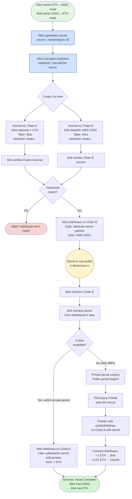
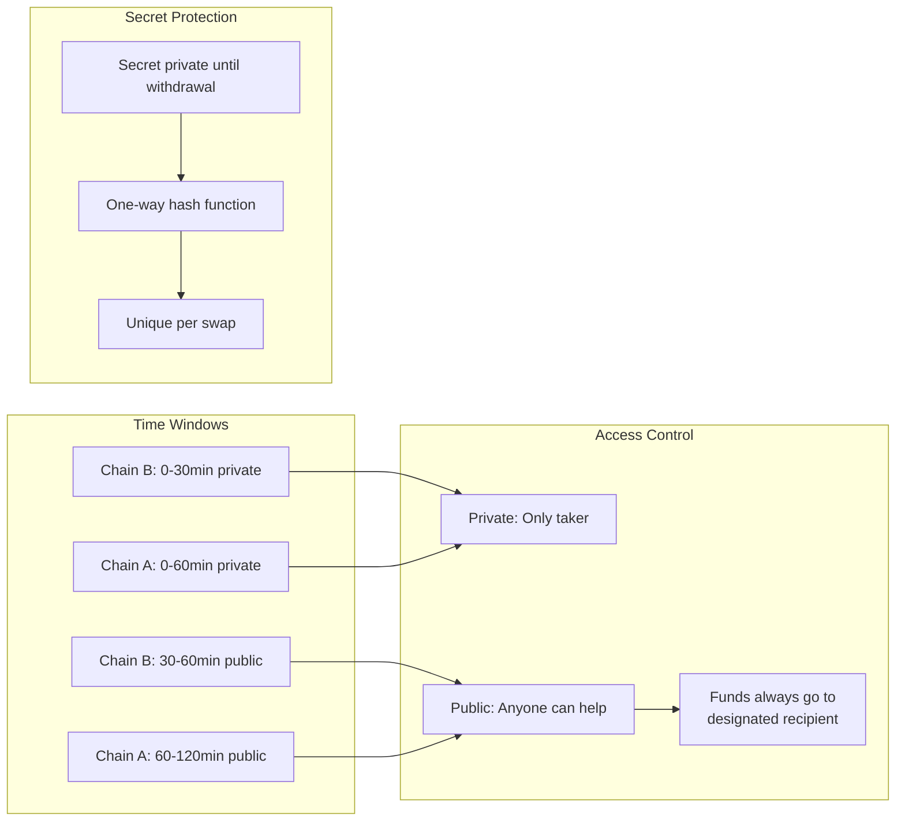
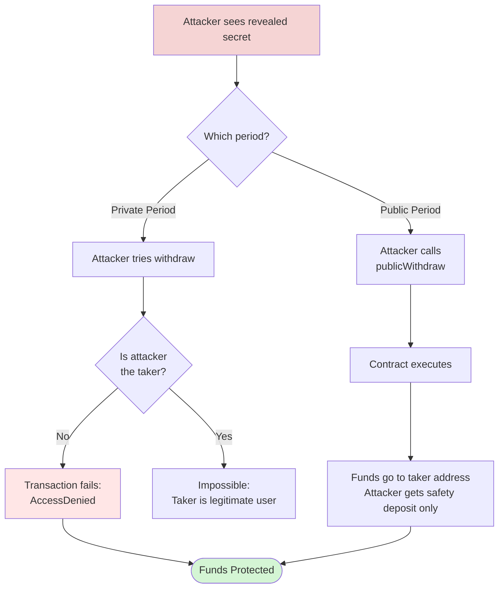

# Cross-Chain Swap Flowchart

## Complete Swap Flow

```mermaid
flowchart TD
    Start([Alice wants ETH→USDC swap<br/>Bob wants USDC→ETH swap])
    
    Start --> GenSecret[Alice generates secret<br/>secret = randomBytes 32]
    GenSecret --> CalcHash[Alice calculates hashlock<br/>hashlock = keccak256 secret]
    
    CalcHash --> CreateEscrows{Create Escrows}
    
    CreateEscrows --> EscrowA[Escrow on Chain A<br/>Alice deposits 1 ETH<br/>Taker: Bob<br/>Hashlock: 0xabc...]
    CreateEscrows --> EscrowB[Escrow on Chain B<br/>Bob deposits 1800 USDC<br/>Taker: Alice<br/>Hashlock: 0xabc...]
    
    EscrowA --> Verify1[Bob verifies Chain A escrow]
    EscrowB --> Verify2[Bob verifies Chain B escrow]
    
    Verify1 --> CheckHash{Hashlocks<br/>match?}
    Verify2 --> CheckHash
    
    CheckHash -->|No| Abort([Abort: Hashlocks don't match])
    CheckHash -->|Yes| AliceWithdraw[Alice withdraws on Chain B<br/>Calls: withdraw secret params<br/>Gets: 1800 USDC]
    
    AliceWithdraw --> SecretRevealed((Secret is now public<br/>in blockchain tx))
    
    SecretRevealed --> BobMonitor[Bob monitors Chain B]
    BobMonitor --> ExtractSecret[Bob extracts secret<br/>from withdrawal tx data]
    
    ExtractSecret --> BobDecide{Is Bob<br/>available?}
    
    BobDecide -->|Yes, within private period| BobWithdraw[Bob withdraws on Chain A<br/>Calls: withdrawTo secret bob params<br/>Gets: 1 ETH]
    
    BobDecide -->|No, Bob offline| PublicPeriod[Private period expires<br/>Public period begins]
    
    PublicPeriod --> ThirdParty[Third party Charlie<br/>sees the secret]
    
    ThirdParty --> CharlieWithdraw[Charlie calls publicWithdraw<br/>on Chain A with secret]
    
    CharlieWithdraw --> Distribution[Contract distributes:<br/>• 1 ETH → Bob<br/>• 0.01 ETH → Charlie]
    
    BobWithdraw --> Success([Success: Swap Complete!<br/>Alice has USDC<br/>Bob has ETH])
    Distribution --> Success
    
    style Start fill:#e1f5e1
    style Success fill:#d4f5d4
    style Abort fill:#f5d4d4
    style SecretRevealed fill:#fff3cd,stroke:#856404
    style GenSecret fill:#cfe2ff,stroke:#084298
    style CalcHash fill:#cfe2ff,stroke:#084298
```

## Security Mechanisms Flow

```mermaid
flowchart LR
    subgraph "Time Windows"
        T1[Chain B: 0-30min private]
        T2[Chain B: 30-60min public]
        T3[Chain A: 0-60min private]
        T4[Chain A: 60-120min public]
    end
    
    subgraph "Access Control"
        AC1[Private: Only taker]
        AC2[Public: Anyone can help]
        AC3[Funds always go to<br/>designated recipient]
    end
    
    subgraph "Secret Protection"
        SP1[Secret private until withdrawal]
        SP2[One-way hash function]
        SP3[Unique per swap]
    end
    
    T1 --> AC1
    T2 --> AC2
    T3 --> AC1
    T4 --> AC2
    
    AC2 --> AC3
    
    SP1 --> SP2
    SP2 --> SP3
```

## Attack Prevention Flow

```mermaid
flowchart TD
    Attack[Attacker sees revealed secret]
    
    Attack --> Period{Which period?}
    
    Period -->|Private Period| TryWithdraw[Attacker tries withdraw]
    TryWithdraw --> CheckTaker{Is attacker<br/>the taker?}
    CheckTaker -->|No| Fail1[Transaction fails:<br/>AccessDenied]
    CheckTaker -->|Yes| Impossible[Impossible:<br/>Taker is legitimate user]
    
    Period -->|Public Period| PublicWithdraw[Attacker calls<br/>publicWithdraw]
    PublicWithdraw --> Execute[Contract executes]
    Execute --> Distribute[Funds go to taker address<br/>Attacker gets safety deposit only]
    
    Fail1 --> Protected([Funds Protected])
    Distribute --> Protected
    
    style Attack fill:#f5d4d4
    style Protected fill:#d4f5d4
    style Fail1 fill:#ffe6e6
```