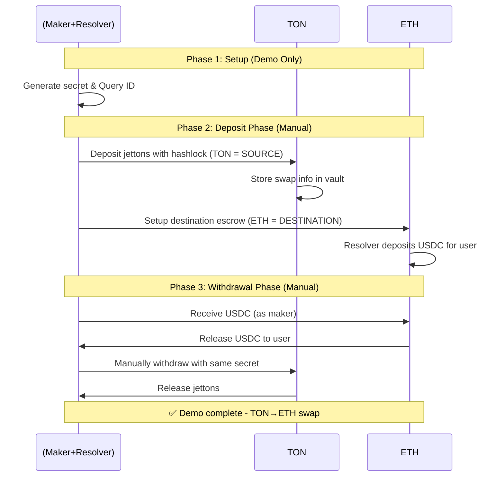
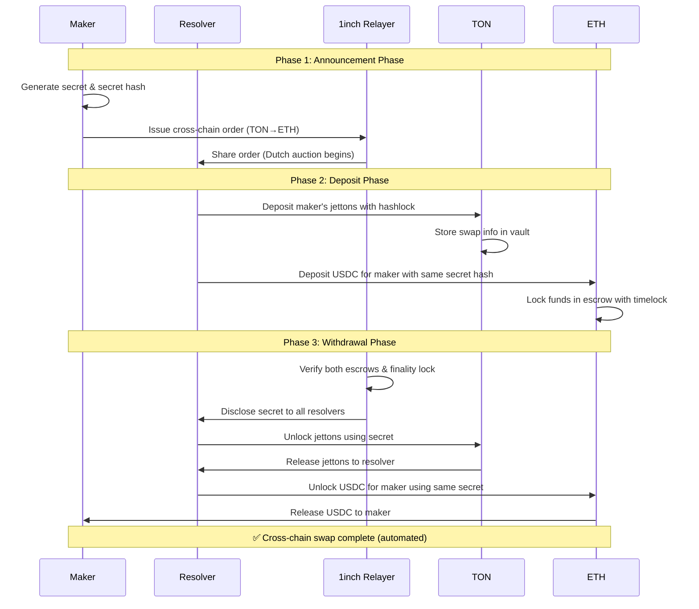

# TON-ETH Atomic Swap: Demo vs Full Protocol

## Demo Implementation (Current)

```mermaid
sequenceDiagram
    participant User as (Maker+Resolver)
    participant TON
    participant ETH

    Note over User, ETH: Phase 1: Setup (Demo Only)
    User->>User: Generate secret & Query ID

    Note over User, ETH: Phase 2: Deposit Phase (Manual)
    User->>TON: Deposit jettons with hashlock (TON = SOURCE)
    TON->>TON: Store swap info in vault
    User->>ETH: Setup destination escrow (ETH = DESTINATION)
    ETH->>ETH: Resolver deposits USDC for user

    Note over User, ETH: Phase 3: Withdrawal Phase (Manual)
    User->>ETH: Receive USDC (as maker)
    ETH->>User: Release USDC to user
    User->>TON: Manually withdraw with same secret
    TON->>User: Release jettons

    Note over User, ETH: ✅ Demo complete - TON→ETH swap
```

## Full 1inch Fusion Protocol (Target)

```mermaid
sequenceDiagram
    participant Maker
    participant Resolver
    participant Relayer as 1inch Relayer
    participant TON
    participant ETH

    Note over Maker, ETH: Phase 1: Announcement Phase
    Maker->>Maker: Generate secret & secret hash
    Maker->>Relayer: Issue cross-chain order (TON→ETH)
    Relayer->>Resolver: Share order (Dutch auction begins)

    Note over Maker, ETH: Phase 2: Deposit Phase
    Resolver->>TON: Deposit maker's jettons with hashlock
    TON->>TON: Store swap info in vault
    Resolver->>ETH: Deposit USDC for maker with same secret hash
    ETH->>ETH: Lock funds in escrow with timelock

    Note over Maker, ETH: Phase 3: Withdrawal Phase
    Relayer->>Relayer: Verify both escrows & finality lock
    Relayer->>Resolver: Disclose secret to all resolvers
    Resolver->>TON: Unlock jettons using secret
    TON->>Resolver: Release jettons to resolver
    Resolver->>ETH: Unlock USDC for maker using same secret
    ETH->>Maker: Release USDC to maker

    Note over Maker, ETH: ✅ Cross-chain swap complete (automated)
```
