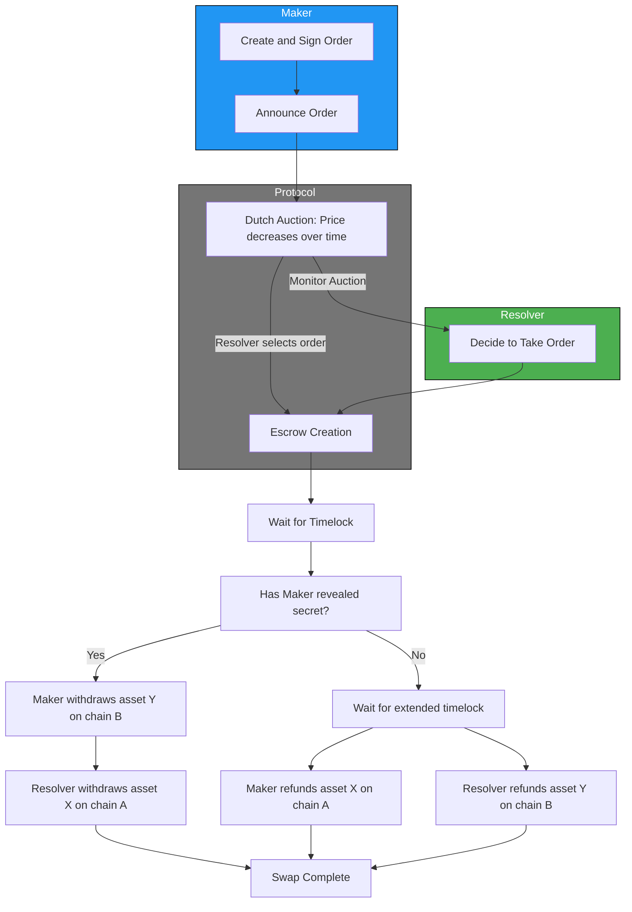

```mermaid
flowchart TD
subgraph Maker [Maker]
A[Create and Sign Order] --> B[Announce Order]
end
subgraph Protocol [Protocol]
B --> C[Dutch Auction: Price decreases over time]
C -->|Resolver selects order| D[Escrow Creation]
end
subgraph Resolver [Resolver]
C -->|Monitor Auction| E[Decide to Take Order]
end
E --> D
D --> F[Wait for Timelock]
F --> G[Has Maker revealed secret?]
G -->|Yes| H[Maker withdraws asset Y on chain B]
G -->|No| I[Wait for extended timelock]
I --> J[Maker refunds asset X on chain A]
I --> K[Resolver refunds asset Y on chain B]
H --> L[Resolver withdraws asset X on chain A]
L --> M[Swap Complete]
J --> M
K --> M
style Maker fill:#2196F3,stroke:#000,color:#fff
style Resolver fill:#4CAF50,stroke:#000,color:#fff
style Protocol fill:#757575,stroke:#000,color:#fff
```
